# Home Workout

Visit the site deployed on github: [HomeWorkout](https://slucaci.github.io/HTMLCSS/index.html)

Welcome to HomeWorkout! Find curated equipment ideas from Amazon and expert nutrition tips to enhance your fitness journey. Start your path to a healthier lifestyle now!

## CONTENTS

- [User Experience](#user-experience-ux)

  - [User Stories](#user-stories)

- [Design](#design)

  - [Colour Scheme](#colour-scheme)
  - [Typography](#typography)
  - [Imagery](#imagery)
  - [Wireframes](#wireframes)
  - [Features](#features)
    - [The Home Page](#the-home-page)
    - [The ContactUs Page](#the-contactus-page)
    - [The Blog Page](#the-blog-page)
    - [The Equipment Page](#the-equipment-page)
    - [The ThankYou Page](#the-thankyou-page)
    - [Future Implementations](#future-implementations)
  - [Accessibility](#accessibility)

- [Technologies Used](#technologies-used)

  - [Languages Used](#languages-used)
  - [Frameworks, Libraries & Programs Used](#frameworks-libraries--programs-used)

- [Deployment & Local Development](#deployment--local-development)

  - [Deployment](#deployment)
  - [Local Development](#local-development)
    - [How to Fork](#how-to-fork)
    - [How to Clone](#how-to-clone)

- [Testing](#testing)
- [Credits](#credits)

  - [Code Used](#code-used)
  - [Content](#content)
  - [Media](#media)
  - [Acknowledgments](#acknowledgments)

  ## User Experience (UX)

  ### User Stories

  #### First time visiting the site

  - As a first-time visitor, I aim to quickly find recommended equipment from Amazon for my needs.

  - As a new visitor, I expect to effortlessly discover top-rated equipment sourced from Amazon.

  #### Freaquent Visitor

  - I want to find different equipment from amazon and for a better price

## Design

For this project, I've opted for a minimalist approach, employing a carefully curated palette of three distinct colors. These colors were chosen to evoke a sense of simplicity and elegance while ensuring visual harmony throughout the design.

### Colour Scheme

I have used the following colors:

| Colour         | Hex                                                              |
| -------------- | ---------------------------------------------------------------- |
| Example Colour |  #0a192f |
| Example Colour |  #024bc0 |
| Example Colour |  #f4f4f6 |

### Typography

I have used google fonts library to import the fonts on my website and the main font on site is "Poppins", followed by "sans-serif" .

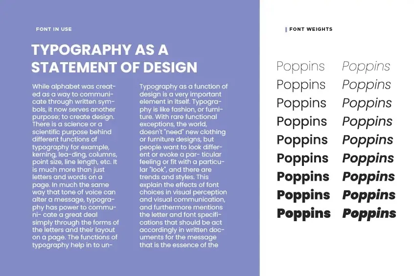

I laso used "font-awesome" library, for icons like instagram, x, tiktok, menu icons etc.
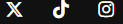
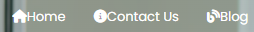
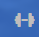

### Imagery

I chose a background image featuring two people working out from home to inspire and resonate with visitors, promoting the accessibility and relevance of our content.

### Wireframes

Wireframes were created for mobile and desktop using Balsamiq.

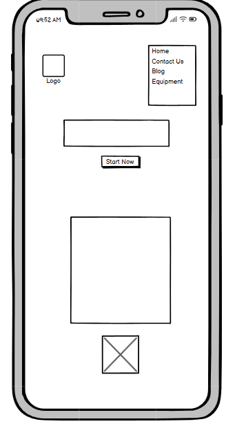
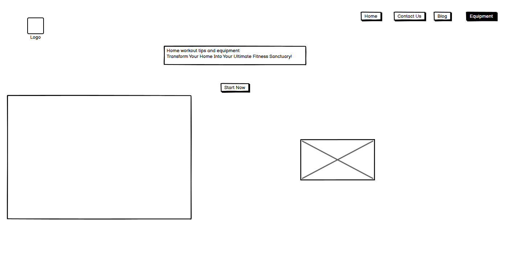

### Features

Explore our site with four visible pages and a hidden "thankyou.html" page, accessible after form completion.
Also the page has a "back to homepage" button to be more visible for the visitors to go on the home page. This button works well for the mobile version because you don't see the "Home" button on the nav bar after completing the form.
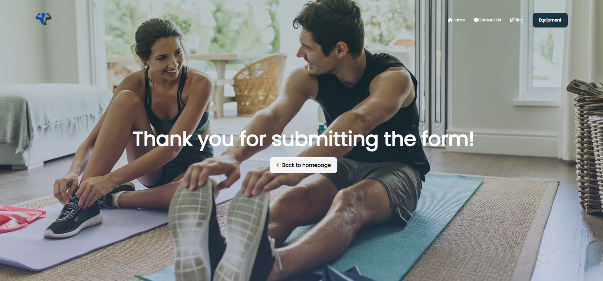

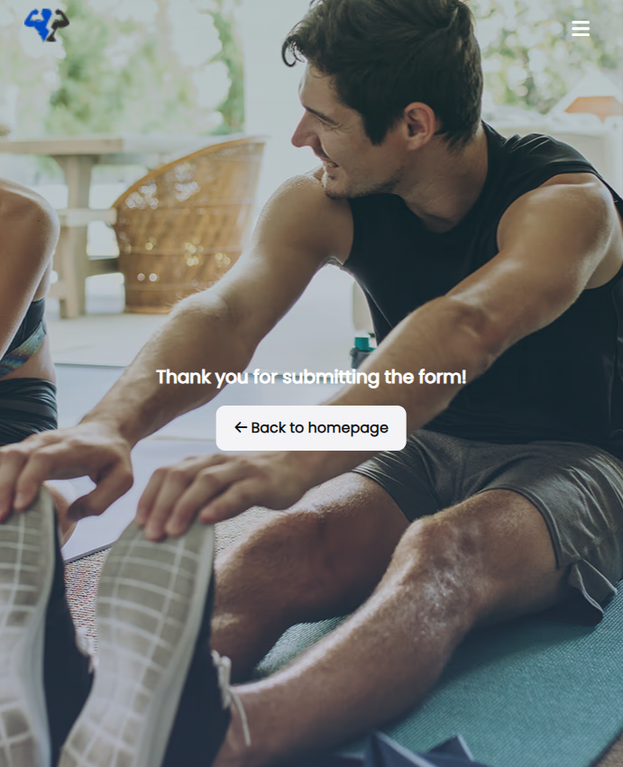

All Pages on the website are responsive and have:

1. A logo, when pressed will return you to the home page
2. A Nav Bar, which will change when using on a mobile device.

- This is the desktop version of the nav bar.
  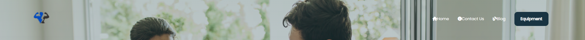

- This is the mobile version of the nav bar.
  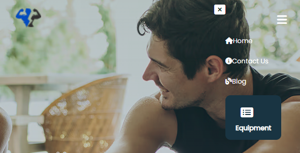

- On the mobile version, I have used a script to hide it when the "x" icon is pressed, and pop the pages when the "navigation" icon is pressed.

3. Every page will display a pointer cursor

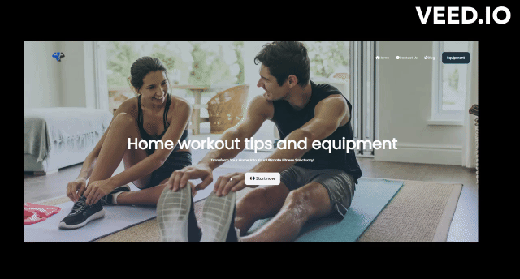

### The Home Page

The home page has a "Start Now" button, which is very important for the website, when pressed, this button will bring visitors on the equipment page.
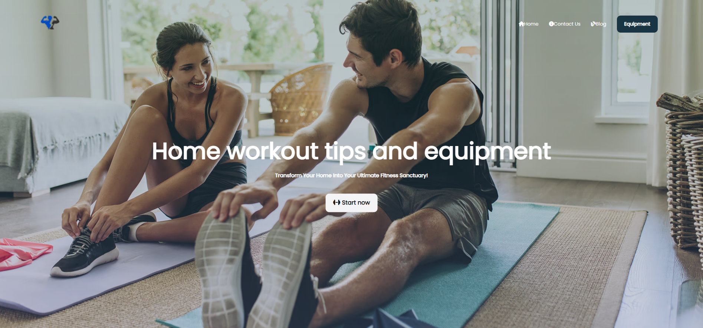

Also the home page has a short "About Us" section down below.

### The ContactUs Page

The Contact Us Page has three things, a form where people ask questions, a map and contact details.
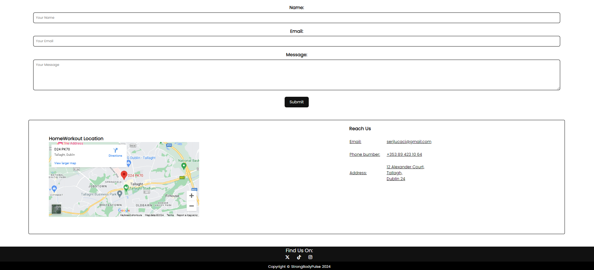

### The Blog Page

On the Blog page I have written the following 3 articles

- 10 Tips for Effective Workouts
- The Importance of Nutrition in Fitness
- 5 Effective Ways to Stay Motivated During Your Workouts

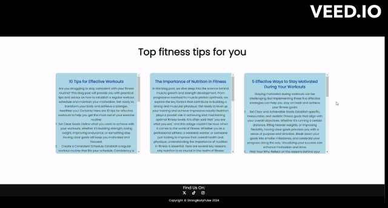

### The Equipment Page

The Equipment page has images and links, when clicked, this link will send people directly to amazon website.

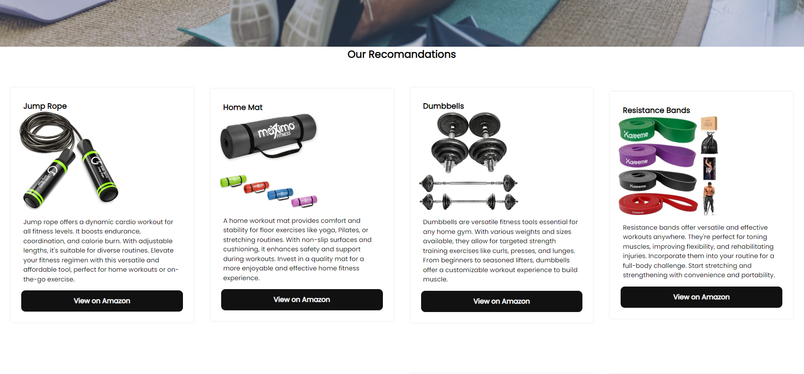

### The ThankYou Page

The "thank you" page is the only page that is not visible initially. It will appear after the client completes the form on the "Contact Us" page.

### Future Implementations

#### I would like to add on my website the following things:

- Login script
- Nutrition plans
- Exercises explained

### Accessibility

1. Alt Text for images

- All images used on this website has an alt text, providing users with screen readers and those with visual impairments with information about the content and purpose of the images.

2. Semantic HTML

3. Hover on all buttons so people know they're about to click on something, also, on this website, the button changes the colour when the mouse is on it.

4. Form Accesibility

- Form on this project inculude appropiate labes and placeholder text.

## Technologies Used

#### Languages Used

HTML, CSS and JavaScript.

#### Frameworks, Libraries & Programs Used

- [README Editor](https://readme.so/editor) - to write the code for readme file
- [ Visual Studio](https://code.visualstudio.com/) - to write the HTML/CSS code

- [ Prettier](https://marketplace.visualstudio.com/items?itemName=esbenp.prettier-vscode) - a VSCode Extension to format the code

- [Balsamiq](https://balsamiq.com/) - for the wireframes.

- [Canva](https://www.canva.com/) - for resizing the images.

- [Cloud Convert](https://cloudconvert.com/webp-converter) - to convert the images into the webp format

- [Github](https://github.com/) - to manage the website

- [Google Fonts](https://fonts.google.com/)

- [Developer Tools](https://developer.chrome.com/docs/devtools) - to arrange the items on the page, to view the pages on different formats

## Deployment & Local Development

### Deployment

The site is deployed using GitHub Pages on - [HomeWorkout](https://slucaci.github.io/HTMLCSS/index.html)

Steps to deploy on github pages:

1. Login to your Github Account
2. Go to: [slucaci/HTMLCSS](https://github.com/slucaci/HTMLCSS).
3. Click the settings button in the middle top of the page
4. Select pages in the left hand side
5. Select main branch and press save.
6. The site is deployed and live using github.

### Local Development

#### How to Fork

To fork the repository:

1. Login to your Github Account.
2. Go to: [slucaci/HTMLCSS](https://github.com/slucaci/HTMLCSS)
3. Click the Fork button in the top right corner.

#### How to Clone

To clone the repository:

1. Login to your Github Account.
2. Go to: [slucaci/HTMLCSS](https://github.com/slucaci/HTMLCSS)
3. On the repository's main page, find the green "Code" button located towards the right side of the page.
4. Copy the URL provided in the textbox.
5. Type 'git clone' into the terminal and then paste the link you copied in step 4. Press enter.

## Testing

Check the [TESTING.md](TESTING.md) file for a detailed summary of all testing procedures conducted.

## Credits

### Code useed

I utilized various YouTube channels to deepen my understanding of HTML and CSS. Special thanks to the following channels:

1. [SuperSimpleDev](https://www.youtube.com/@SuperSimpleDev)
2. [Bro Code](https://www.youtube.com/@BroCodez)
3. [tuv](https://www.youtube.com/@tutvid)

### Content

- All images for my Equipment page were sourced from Amazon.
- All content for the Blog section was summarized from various sources found on Google.

### Media

The backgroud image was downloaded from google from the following [link](https://toughmudder.co.uk/blog/no-excuses/top-10-indoor-workouts-you-can-do-at-home/).

The logo was created using Canva Pro.

### Acknowledgments

- Graeme Taylor - Code Institute Mentor

- Madalina Martinas - my girlfriend, suggested different ideas about products to put on my website.

- The Slack channel from Code Institute was where I found useful answers regarding my problems during the project.
