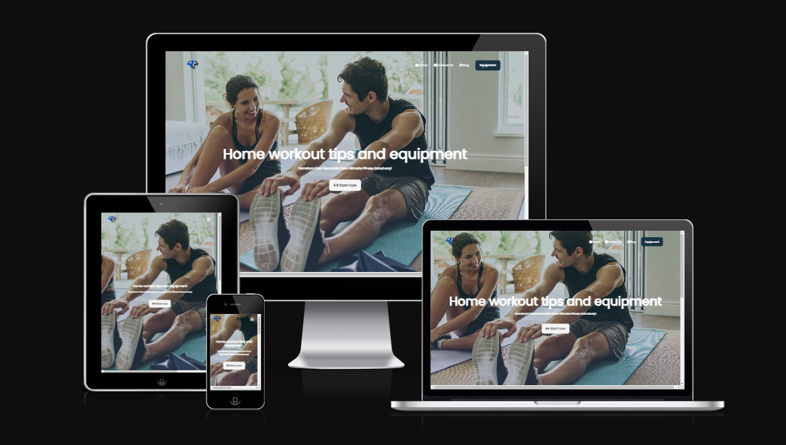
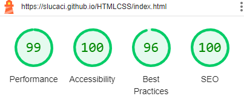
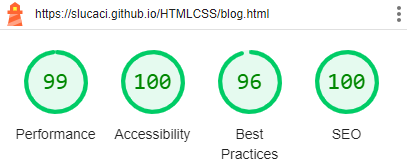
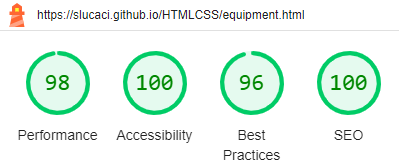
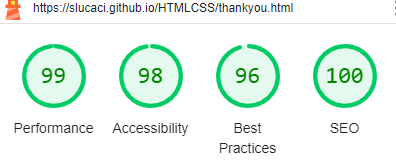
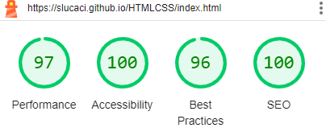
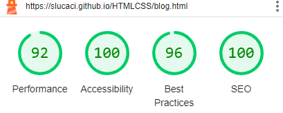
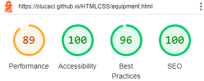
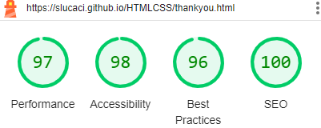

# Home Workout

Visit the site deployed on github: [HomeWorkout](https://slucaci.github.io/HTMLCSS/index.html)

## CONTENTS

- [AUTOMATED TESTING](#AUTOMATED-TESTING)

  - [W3C Validator](#W3C-Validator)

  - [Lighthouse](#Lighthouse)

- [MANUAL TESTING](#MANUAL-TESTING)

  - [Testing User Stories](#Testing-User-Stories)

  - [Full Testing](#Full-Testing)

## AUTOMATED TESTING

### W3C Validator

[HTML W3C](https://validator.w3.org/) was used to validate the HTML code.

- [Home Page](https://slucaci.github.io/HTMLCSS/index.html) - 0 errors
- [Contact Us Page](https://slucaci.github.io/HTMLCSS/contactus.html) - 0 erros
- [Blog Page](https://slucaci.github.io/HTMLCSS/blog.html) - 0 errors
- [Equipment Page](https://slucaci.github.io/HTMLCSS/equipment.html) - 0 errors
- [Thank You Page](https://slucaci.github.io/HTMLCSS/thankyou.html) - 0 errors

[ CSS W3C](https://jigsaw.w3.org/css-validator/) was used to validate the CSS code.

- style.css file - 0 errors
  

### LightHouse

I have used developer tools Lighthouse to do tests on my website pages on mobile and desktop version.

#### Desktop Version

#### Mobile Version

## Manual Testing
